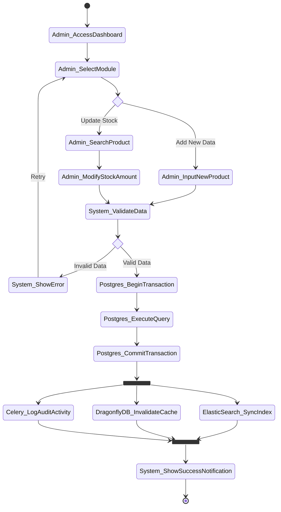

# UML Activity Diagram - Admin Data Management

```mermaid
stateDiagram-v2
    direction TB
    
    [*] --> Admin_AccessDashboard
    Admin_AccessDashboard --> Admin_SelectModule
    
    state action_choice <<choice>>
    Admin_SelectModule --> action_choice
    
    action_choice --> Admin_InputNewProduct : Add New Data
    action_choice --> Admin_SearchProduct : Update Stock
    
    Admin_SearchProduct --> Admin_ModifyStockAmount
    
    Admin_InputNewProduct --> System_ValidateData
    Admin_ModifyStockAmount --> System_ValidateData
    
    state validation_choice <<choice>>
    System_ValidateData --> validation_choice
    
    validation_choice --> System_ShowError : Invalid Data
    System_ShowError --> Admin_SelectModule : Retry
    
    validation_choice --> Postgres_BeginTransaction : Valid Data
    
    Postgres_BeginTransaction --> Postgres_ExecuteQuery
    Postgres_ExecuteQuery --> Postgres_CommitTransaction
    
    state post_save_fork <<fork>>
    Postgres_CommitTransaction --> post_save_fork
    
    post_save_fork --> ElasticSearch_SyncIndex
    post_save_fork --> DragonflyDB_InvalidateCache
    post_save_fork --> Celery_LogAuditActivity
    
    state post_save_join <<join>>
    ElasticSearch_SyncIndex --> post_save_join
    DragonflyDB_InvalidateCache --> post_save_join
    Celery_LogAuditActivity --> post_save_join
    
    post_save_join --> System_ShowSuccessNotification
    System_ShowSuccessNotification --> [*]
```
