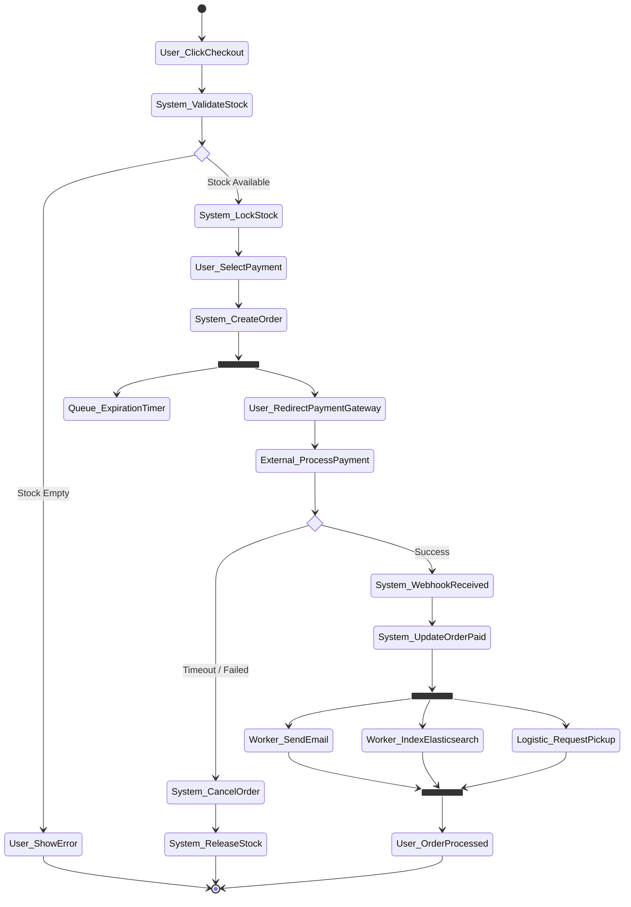

# UML Activity Diagram - Checkout & Payment

```mermaid
stateDiagram-v2
    direction TB
    
    [*] --> User_ClickCheckout
    User_ClickCheckout --> System_ValidateStock
    
    state stock_check <<choice>>
    System_ValidateStock --> stock_check
    stock_check --> User_ShowError : Stock Empty
    User_ShowError --> [*]
    
    stock_check --> System_LockStock : Stock Available
    System_LockStock --> User_SelectPayment
    
    User_SelectPayment --> System_CreateOrder
    
    state async_fork <<fork>>
    System_CreateOrder --> async_fork
    
    async_fork --> Queue_ExpirationTimer
    async_fork --> User_RedirectPaymentGateway
    
    User_RedirectPaymentGateway --> External_ProcessPayment
    
    state payment_status <<choice>>
    External_ProcessPayment --> payment_status
    
    payment_status --> System_CancelOrder : Timeout / Failed
    System_CancelOrder --> System_ReleaseStock
    System_ReleaseStock --> [*]
    
    payment_status --> System_WebhookReceived : Success
    System_WebhookReceived --> System_UpdateOrderPaid
    
    state post_payment_fork <<fork>>
    System_UpdateOrderPaid --> post_payment_fork
    
    post_payment_fork --> Worker_SendEmail
    post_payment_fork --> Worker_IndexElasticsearch
    post_payment_fork --> Logistic_RequestPickup
    
    state post_payment_join <<join>>
    Worker_SendEmail --> post_payment_join
    Worker_IndexElasticsearch --> post_payment_join
    Logistic_RequestPickup --> post_payment_join
    
    post_payment_join --> User_OrderProcessed
    User_OrderProcessed --> [*]
```
