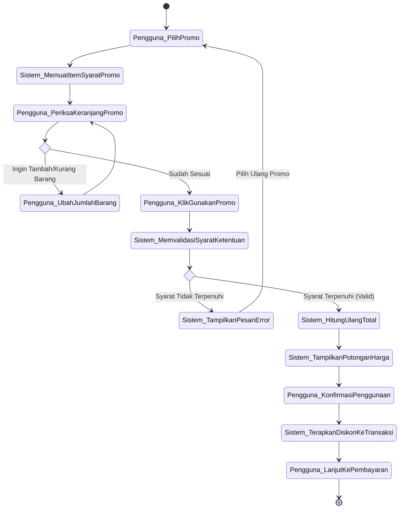

# UML Activity Diagram - Alur Validasi & Klaim Promo (Human Readable)

```mermaid
stateDiagram-v2
    direction TB
    
    [*] --> Pengguna_PilihPromo
    Pengguna_PilihPromo --> Sistem_MemuatItemSyaratPromo
    
    Sistem_MemuatItemSyaratPromo --> Pengguna_PeriksaKeranjangPromo
    
    state cek_kuantitas <<choice>>
    Pengguna_PeriksaKeranjangPromo --> cek_kuantitas
    
    cek_kuantitas --> Pengguna_UbahJumlahBarang : Ingin Tambah/Kurang Barang
    Pengguna_UbahJumlahBarang --> Pengguna_PeriksaKeranjangPromo
    
    cek_kuantitas --> Pengguna_KlikGunakanPromo : Sudah Sesuai
    
    Pengguna_KlikGunakanPromo --> Sistem_MemvalidasiSyaratKetentuan
    
    state hasil_validasi <<choice>>
    Sistem_MemvalidasiSyaratKetentuan --> hasil_validasi
    
    hasil_validasi --> Sistem_TampilkanPesanError : Syarat Tidak Terpenuhi
    Sistem_TampilkanPesanError --> Pengguna_PilihPromo : Pilih Ulang Promo
    
    hasil_validasi --> Sistem_HitungUlangTotal : Syarat Terpenuhi (Valid)
    
    Sistem_HitungUlangTotal --> Sistem_TampilkanPotonganHarga
    Sistem_TampilkanPotonganHarga --> Pengguna_KonfirmasiPenggunaan
    
    Pengguna_KonfirmasiPenggunaan --> Sistem_TerapkanDiskonKeTransaksi
    Sistem_TerapkanDiskonKeTransaksi --> Pengguna_LanjutKePembayaran
    
    Pengguna_LanjutKePembayaran --> [*]
```
