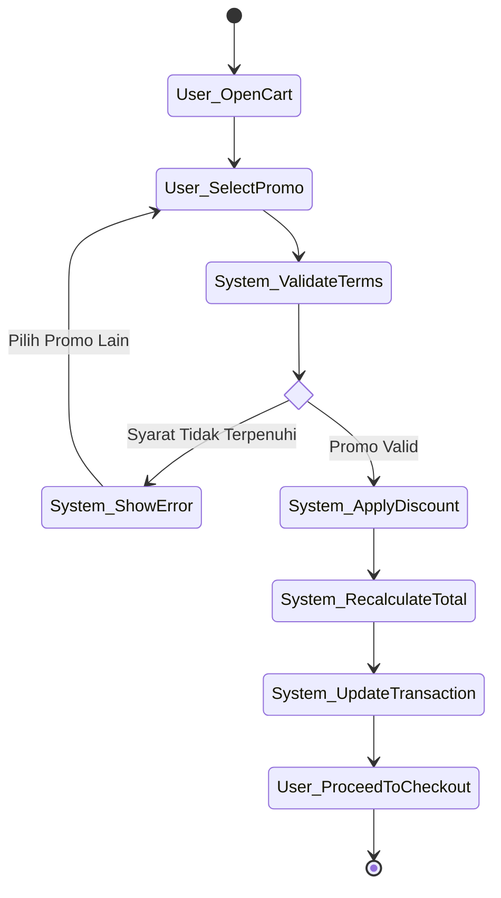

# UML Activity Diagram - Alur Claim Promo Pengguna

```mermaid
stateDiagram-v2
    direction TB
    
    [*] --> User_OpenCart
    User_OpenCart --> User_SelectPromo
    
    User_SelectPromo --> System_ValidateTerms
    
    state validation_decision <<choice>>
    System_ValidateTerms --> validation_decision
    
    validation_decision --> System_ShowError : Syarat Tidak Terpenuhi
    System_ShowError --> User_SelectPromo : Pilih Promo Lain
    
    validation_decision --> System_ApplyDiscount : Promo Valid
    
    System_ApplyDiscount --> System_RecalculateTotal
    System_RecalculateTotal --> System_UpdateTransaction
    
    System_UpdateTransaction --> User_ProceedToCheckout
    User_ProceedToCheckout --> [*]
```
