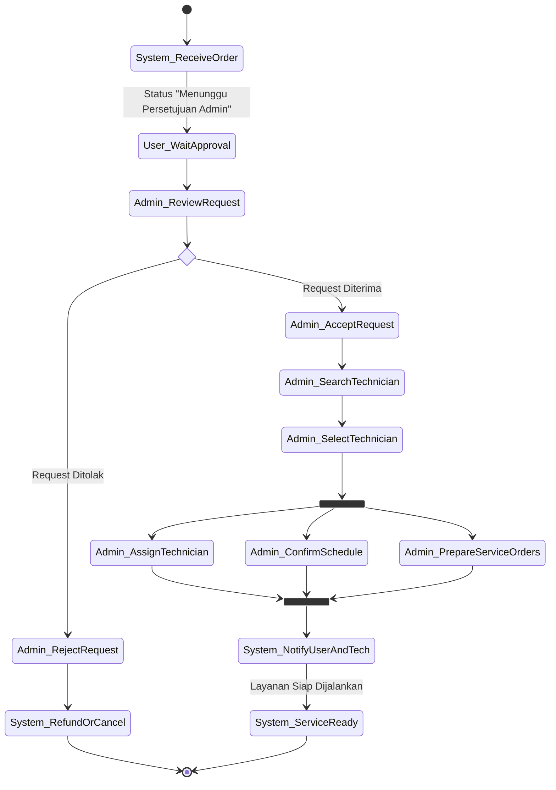

# UML Activity Diagram - Alur Validasi Jasa

```mermaid
stateDiagram-v2
    direction TB
    
    [*] --> System_ReceiveOrder
    System_ReceiveOrder --> User_WaitApproval : Status "Menunggu Persetujuan Admin"
    
    User_WaitApproval --> Admin_ReviewRequest
    
    state review_decision <<choice>>
    Admin_ReviewRequest --> review_decision
    
    review_decision --> Admin_RejectRequest : Request Ditolak
    Admin_RejectRequest --> System_RefundOrCancel
    System_RefundOrCancel --> [*]
    
    review_decision --> Admin_AcceptRequest : Request Diterima
    Admin_AcceptRequest --> Admin_SearchTechnician
    
    Admin_SearchTechnician --> Admin_SelectTechnician
    
    state setup_fork <<fork>>
    Admin_SelectTechnician --> setup_fork
    
    setup_fork --> Admin_AssignTechnician
    setup_fork --> Admin_ConfirmSchedule
    setup_fork --> Admin_PrepareServiceOrders
    
    state setup_join <<join>>
    Admin_AssignTechnician --> setup_join
    Admin_ConfirmSchedule --> setup_join
    Admin_PrepareServiceOrders --> setup_join
    
    setup_join --> System_NotifyUserAndTech
    System_NotifyUserAndTech --> System_ServiceReady : Layanan Siap Dijalankan
    System_ServiceReady --> [*]
```
