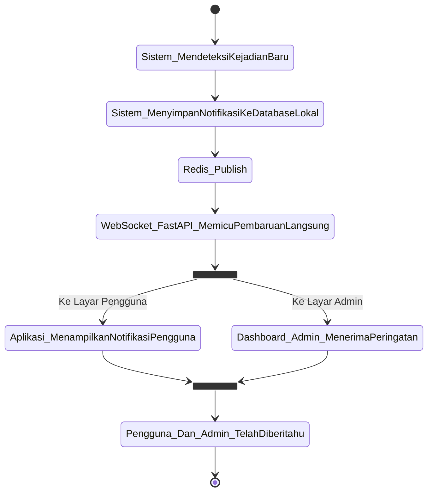

# UML Activity Diagram - Alur Notifikasi Pengguna & Admin (WebSocket Lokal)

```mermaid
stateDiagram-v2
    direction TB
    
    [*] --> Sistem_MendeteksiKejadianBaru
    Sistem_MendeteksiKejadianBaru --> Sistem_MenyimpanNotifikasiKeDatabaseLokal
    
    Sistem_MenyimpanNotifikasiKeDatabaseLokal --> Redis_Publish
    Redis_Publish --> WebSocket_FastAPI_MemicuPembaruanLangsung
    
    state pengiriman_paralel <<fork>>
    WebSocket_FastAPI_MemicuPembaruanLangsung --> pengiriman_paralel
    
    pengiriman_paralel --> Aplikasi_MenampilkanNotifikasiPengguna : Ke Layar Pengguna
    pengiriman_paralel --> Dashboard_Admin_MenerimaPeringatan : Ke Layar Admin
    
    state pengiriman_selesai <<join>>
    Aplikasi_MenampilkanNotifikasiPengguna --> pengiriman_selesai
    Dashboard_Admin_MenerimaPeringatan --> pengiriman_selesai
    
    pengiriman_selesai --> Pengguna_Dan_Admin_TelahDiberitahu
    Pengguna_Dan_Admin_TelahDiberitahu --> [*]
```
