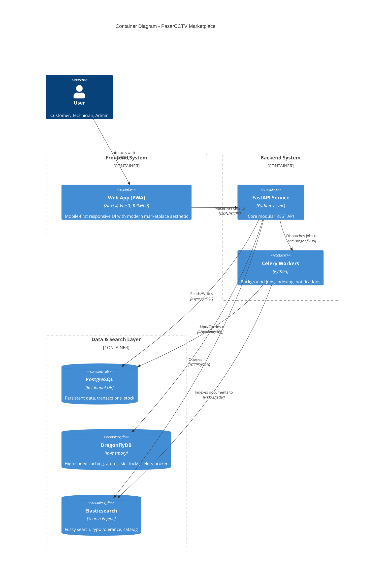

# Container Diagram

```mermaid
C4Container
  title Container Diagram - PasarCCTV Marketplace

  Person(user, "User", "Customer, Technician, Admin")

  Container_Boundary(frontend, "Frontend System") {
    Container(pwa, "Web App (PWA)", "Nuxt 4, Vue 3, Tailwind", "Mobile-first responsive UI with modern marketplace aesthetic")
  }

  Container_Boundary(backend, "Backend System") {
    Container(api, "FastAPI Service", "Python, async", "Core modular REST API")
    Container(celery, "Celery Workers", "Python", "Background jobs, indexing, notifications")
  }

  Container_Boundary(data, "Data & Search Layer") {
    ContainerDb(pg, "PostgreSQL", "Relational DB", "Persistent data, transactions, stock")
    ContainerDb(redis, "DragonflyDB", "In-memory", "High-speed caching, atomic slot locks, celery broker")
    ContainerDb(es, "Elasticsearch", "Search Engine", "Fuzzy search, typo tolerance, catalog")
  }

  Rel(user, pwa, "Interacts with", "HTTPS")
  Rel(pwa, api, "Makes API calls to", "JSON/HTTPS")
  
  Rel(api, pg, "Reads/Writes", "asyncpg/SQL")
  Rel(api, redis, "Locks/Caches", "Redis Protocol")
  Rel(api, es, "Queries", "HTTPS/JSON")
  
  Rel(api, celery, "Dispatches jobs to", "via DragonflyDB")
  Rel(celery, pg, "Updates state", "asyncpg/SQL")
  Rel(celery, es, "Indexes documents to", "HTTPS/JSON")
```
