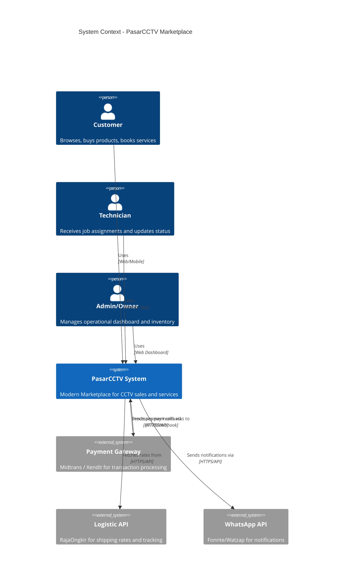

# System Context Diagram

```mermaid
C4Context
  title System Context - PasarCCTV Marketplace

  Person(customer, "Customer", "Browses, buys products, books services")
  Person(tech, "Technician", "Receives job assignments and updates status")
  Person(admin, "Admin/Owner", "Manages operational dashboard and inventory")

  System(marketplace, "PasarCCTV System", "Modern Marketplace for CCTV sales and services")
  
  System_Ext(payment, "Payment Gateway", "Midtrans / Xendit for transaction processing")
  System_Ext(courier, "Logistic API", "RajaOngkir for shipping rates and tracking")
  System_Ext(wa, "WhatsApp API", "Fonnte/Watzap for notifications")

  Rel(customer, marketplace, "Uses", "Web/Mobile")
  Rel(tech, marketplace, "Uses", "Mobile App")
  Rel(admin, marketplace, "Uses", "Web Dashboard")

  Rel(marketplace, payment, "Processes payments via", "HTTPS/API")
  Rel(marketplace, courier, "Fetches rates from", "HTTPS/API")
  Rel(marketplace, wa, "Sends notifications via", "HTTPS/API")
  Rel(payment, marketplace, "Sends payment callbacks to", "HTTPS/Webhook")
```
