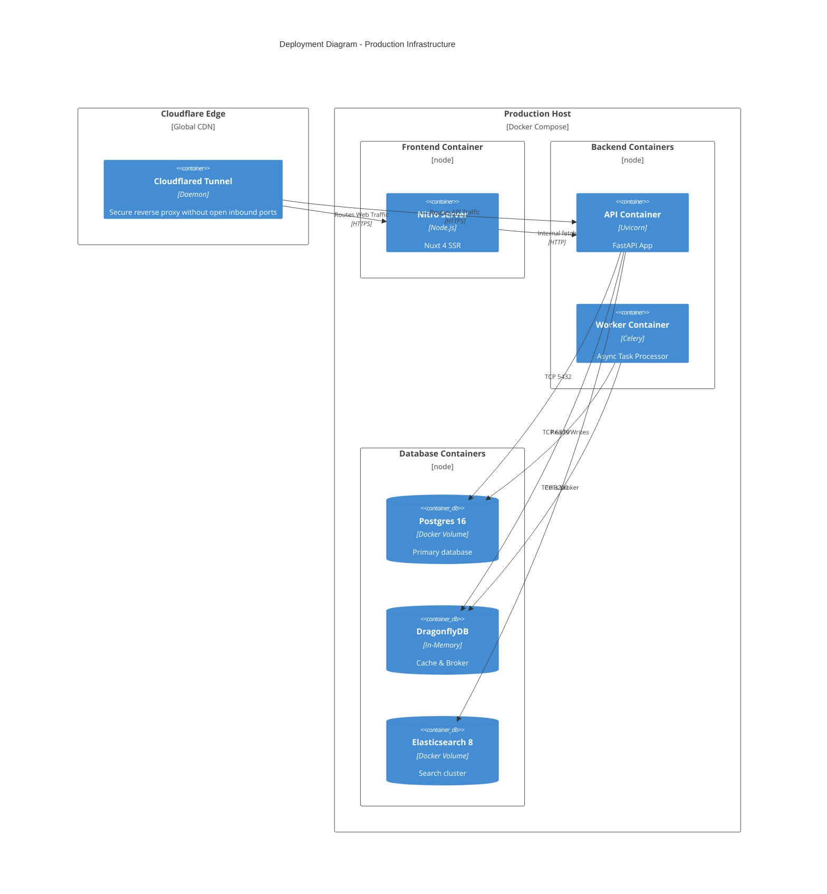

# Deployment Diagram

```mermaid
C4Deployment
  title Deployment Diagram - Production Infrastructure

  Deployment_Node(cloudflare, "Cloudflare Edge", "Global CDN") {
    Container(tunnel, "Cloudflared Tunnel", "Daemon", "Secure reverse proxy without open inbound ports")
  }

  Deployment_Node(host, "Production Host", "Docker Compose") {
    Deployment_Node(web, "Frontend Container") {
      Container(nuxt, "Nitro Server", "Node.js", "Nuxt 4 SSR")
    }
    
    Deployment_Node(app, "Backend Containers") {
      Container(fastapi, "API Container", "Uvicorn", "FastAPI App")
      Container(worker, "Worker Container", "Celery", "Async Task Processor")
    }

    Deployment_Node(db, "Database Containers") {
      ContainerDb(postgres, "Postgres 16", "Docker Volume", "Primary database")
      ContainerDb(dragonfly, "DragonflyDB", "In-Memory", "Cache & Broker")
      ContainerDb(elasticsearch, "Elasticsearch 8", "Docker Volume", "Search cluster")
    }
  }

  Rel(tunnel, nuxt, "Routes Web Traffic", "HTTPS")
  Rel(tunnel, fastapi, "Routes API Traffic", "HTTPS")
  
  Rel(nuxt, fastapi, "Internal fetch", "HTTP")
  Rel(fastapi, postgres, "TCP 5432")
  Rel(fastapi, dragonfly, "TCP 6379")
  Rel(fastapi, elasticsearch, "TCP 9200")
  
  Rel(worker, dragonfly, "Polls broker")
  Rel(worker, postgres, "Reads/Writes")
```
