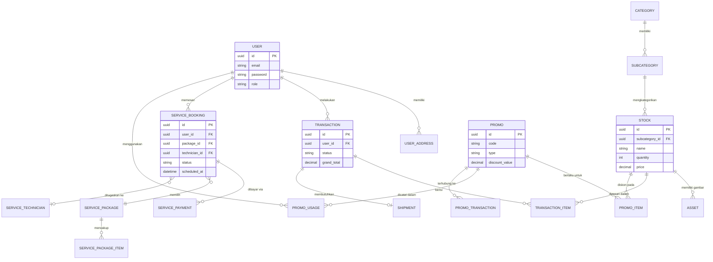

# Entity Relationship Diagram (ERD) - Core Marketplace

```mermaid
erDiagram
    %% Auth & User Domain
    USER ||--o{ USER_ADDRESS : "memiliki"
    USER ||--o{ TRANSACTION : "melakukan"
    USER ||--o{ SERVICE_BOOKING : "memesan"
    USER ||--o{ PROMO_USAGE : "menggunakan"

    %% Catalog & Product Domain
    CATEGORY ||--o{ SUBCATEGORY : "memiliki"
    SUBCATEGORY ||--o{ STOCK : "mengkategorikan"
    STOCK ||--o{ ASSET : "memiliki gambar"
    STOCK ||--o{ TRANSACTION_ITEM : "dipesan dalam"
    STOCK ||--o{ PROMO_ITEM : "diskon pada"

    %% Physical Transaction Domain
    TRANSACTION ||--o{ TRANSACTION_ITEM : "berisi"
    TRANSACTION ||--o| SHIPMENT : "membutuhkan"

    %% Service (Jasa) Domain
    SERVICE_PACKAGE ||--o{ SERVICE_PACKAGE_ITEM : "mencakup"
    SERVICE_BOOKING ||--o{ SERVICE_PAYMENT : "dibayar via"
    SERVICE_BOOKING }o--|| SERVICE_PACKAGE : "memilih"
    SERVICE_BOOKING }o--o| SERVICE_TECHNICIAN : "ditugaskan ke"

    %% Promo Domain
    PROMO ||--o{ PROMO_ITEM : "berlaku untuk"
    PROMO ||--o{ PROMO_USAGE : "dicatat dalam"
    PROMO ||--o{ PROMO_TRANSACTION : "terhubung ke"

    %% Core Table Definitions
    USER {
        uuid id PK
        string email
        string password
        string role
    }

    STOCK {
        uuid id PK
        uuid subcategory_id FK
        string name
        int quantity
        decimal price
    }

    TRANSACTION {
        uuid id PK
        uuid user_id FK
        string status
        decimal grand_total
    }

    SERVICE_BOOKING {
        uuid id PK
        uuid user_id FK
        uuid package_id FK
        uuid technician_id FK
        string status
        datetime scheduled_at
    }

    PROMO {
        uuid id PK
        string code
        string type
        decimal discount_value
    }
```
