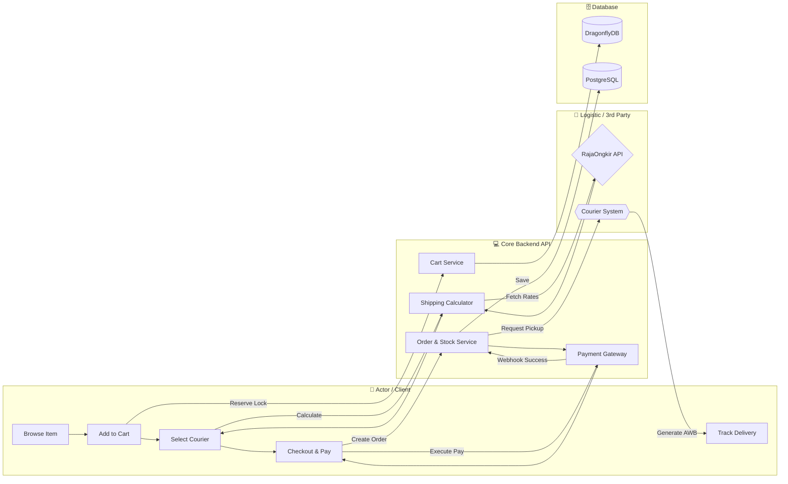

# Flowchart - Buy Item (Physical Goods)

```mermaid
flowchart LR
    subgraph Client [🧑 Actor / Client]
        Browse[Browse Item]
        Cart[Add to Cart]
        Shipping[Select Courier]
        Checkout[Checkout & Pay]
        Track[Track Delivery]
    end

    subgraph System [💻 Core Backend API]
        APICart[Cart Service]
        APIShipping[Shipping Calculator]
        APIOrder[Order & Stock Service]
        APIPay[Payment Gateway]
    end

    subgraph Logistic [🚚 Logistic / 3rd Party]
        RajaOngkir{RajaOngkir API}
        Courier{{Courier System}}
    end

    subgraph Storage [🗄️ Database]
        Redis[(DragonflyDB)]
        PG[(PostgreSQL)]
    end

    Browse --> Cart
    Cart -->|Reserve Lock| APICart
    APICart --> Redis
    Cart --> Shipping
    Shipping -->|Calculate| APIShipping
    APIShipping -->|Fetch Rates| RajaOngkir
    RajaOngkir --> APIShipping
    APIShipping --> Shipping
    Shipping --> Checkout
    Checkout -->|Create Order| APIOrder
    APIOrder -->|Save| PG
    APIOrder --> APIPay
    APIPay --> Checkout
    Checkout -->|Execute Pay| APIPay
    APIPay -->|Webhook Success| APIOrder
    APIOrder -->|Request Pickup| Courier
    Courier -->|Generate AWB| Track
```
