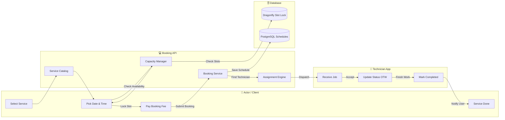

# Flowchart - Buy Service (Jasa)

```mermaid
flowchart LR
    subgraph Client [🧑 Actor / Client]
        Browse[Select Service]
        Schedule[Pick Date & Time]
        Checkout[Pay Booking Fee]
        Complete[Service Done]
    end

    subgraph System [💻 Booking API]
        APICatalog[Service Catalog]
        APICapacity[Capacity Manager]
        APIOrder[Booking Service]
        APIAssign[Assignment Engine]
    end

    subgraph Storage [🗄️ Database]
        Redis[(Dragonfly Slot Lock)]
        PG[(PostgreSQL Schedules)]
    end

    subgraph Tech [👷 Technician App]
        Notify[Receive Job]
        OTW[Update Status OTW]
        Done[Mark Completed]
    end

    Browse --> APICatalog
    APICatalog --> Schedule
    Schedule -->|Check Availability| APICapacity
    APICapacity -->|Check Slots| Redis
    APICapacity --> Schedule
    Schedule -->|Lock Slot| Checkout
    Checkout -->|Submit Booking| APIOrder
    APIOrder -->|Save Schedule| PG
    APIOrder -->|Find Technician| APIAssign
    APIAssign -->|Dispatch| Notify
    Notify -->|Accept| OTW
    OTW -->|Finish Work| Done
    Done -->|Notify User| Complete
```
