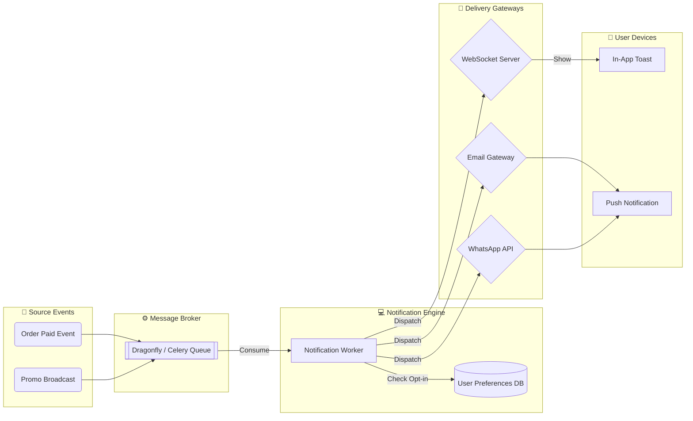

# Flowchart - System Notification Pipeline

```mermaid
flowchart LR
    subgraph Trigger [🚀 Source Events]
        EvOrder(Order Paid Event)
        EvPromo(Promo Broadcast)
    end

    subgraph Queue [⚙️ Message Broker]
        MQ[[Dragonfly / Celery Queue]]
    end

    subgraph Processor [💻 Notification Engine]
        Worker[Notification Worker]
        DBPrefs[(User Preferences DB)]
    end

    subgraph Delivery [📡 Delivery Gateways]
        GWEmail{Email Gateway}
        GWWA{WhatsApp API}
        GWWS{WebSocket Server}
    end

    subgraph Client [📱 User Devices]
        Toast[In-App Toast]
        Push[Push Notification]
    end

    EvOrder --> MQ
    EvPromo --> MQ
    MQ -->|Consume| Worker
    Worker -->|Check Opt-in| DBPrefs
    Worker -->|Dispatch| GWEmail
    Worker -->|Dispatch| GWWA
    Worker -->|Dispatch| GWWS
    GWWS -->|Show| Toast
    GWEmail --> Push
    GWWA --> Push
```
