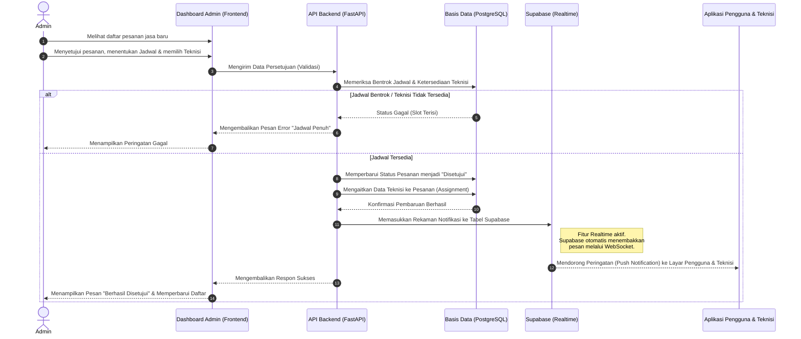

# UML Sequence Diagram - Penanganan Validasi Jasa oleh Admin

```mermaid
sequenceDiagram
    autonumber
    
    actor Admin
    participant AdminUI as Dashboard Admin (Frontend)
    participant API as API Backend (FastAPI)
    participant DB as Basis Data (PostgreSQL)
    participant Realtime as Supabase (Realtime)
    participant App as Aplikasi Pengguna & Teknisi
    
    Admin->>AdminUI: Melihat daftar pesanan jasa baru
    Admin->>AdminUI: Menyetujui pesanan, menentukan Jadwal & memilih Teknisi
    AdminUI->>API: Mengirim Data Persetujuan (Validasi)
    
    API->>DB: Memeriksa Bentrok Jadwal & Ketersediaan Teknisi
    
    alt Jadwal Bentrok / Teknisi Tidak Tersedia
        DB-->>API: Status Gagal (Slot Terisi)
        API-->>AdminUI: Mengembalikan Pesan Error "Jadwal Penuh"
        AdminUI-->>Admin: Menampilkan Peringatan Gagal
    else Jadwal Tersedia
        API->>DB: Memperbarui Status Pesanan menjadi "Disetujui"
        API->>DB: Mengaitkan Data Teknisi ke Pesanan (Assignment)
        DB-->>API: Konfirmasi Pembaruan Berhasil
        
        API->>Realtime: Memasukkan Rekaman Notifikasi ke Tabel Supabase
        Note right of Realtime: Fitur Realtime aktif.<br/>Supabase otomatis menembakkan<br/>pesan melalui WebSocket.
        Realtime-->>App: Mendorong Peringatan (Push Notification) ke Layar Pengguna & Teknisi
        
        API-->>AdminUI: Mengembalikan Respon Sukses
        AdminUI-->>Admin: Menampilkan Pesan "Berhasil Disetujui" & Memperbarui Daftar
    end
```
