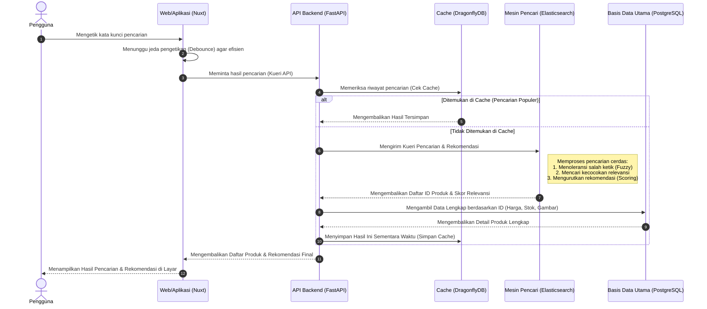

# UML Sequence Diagram - Sistem Pencarian & Rekomendasi (Elasticsearch)

```mermaid
sequenceDiagram
    autonumber
    
    actor Pengguna
    participant Frontend as Web/Aplikasi (Nuxt)
    participant API as API Backend (FastAPI)
    participant Cache as Cache (DragonflyDB)
    participant ES as Mesin Pencari (Elasticsearch)
    participant DB as Basis Data Utama (PostgreSQL)
    
    Pengguna->>Frontend: Mengetik kata kunci pencarian
    Frontend->>Frontend: Menunggu jeda pengetikan (Debounce) agar efisien
    Frontend->>API: Meminta hasil pencarian (Kueri API)
    
    API->>Cache: Memeriksa riwayat pencarian (Cek Cache)
    
    alt Ditemukan di Cache (Pencarian Populer)
        Cache-->>API: Mengembalikan Hasil Tersimpan
    else Tidak Ditemukan di Cache
        API->>ES: Mengirim Kueri Pencarian & Rekomendasi
        Note right of ES: Memproses pencarian cerdas:<br/>1. Menoleransi salah ketik (Fuzzy)<br/>2. Mencari kecocokan relevansi<br/>3. Mengurutkan rekomendasi (Scoring)
        ES-->>API: Mengembalikan Daftar ID Produk & Skor Relevansi
        
        API->>DB: Mengambil Data Lengkap berdasarkan ID (Harga, Stok, Gambar)
        DB-->>API: Mengembalikan Detail Produk Lengkap
        
        API->>Cache: Menyimpan Hasil Ini Sementara Waktu (Simpan Cache)
    end
    
    API-->>Frontend: Mengembalikan Daftar Produk & Rekomendasi Final
    Frontend-->>Pengguna: Menampilkan Hasil Pencarian & Rekomendasi di Layar
```
